---
lab:
  title: Develop your first AI agent in Microsoft Foundry
  description: Use Microsoft Foundry and Visual Studio Code to create an agent.
  level: 200
  duration: 60 minutes
  islab: true
---

# Develop your first AI agent in Microsoft Foundry

In this lab, you'll use Microsoft Foundry to develop an AI agent that provides information and expertise on the history of computing.

> **Note**: Many components of Microsoft Foundry, including the Microsoft Foundry portal, are subject to continual development. This reflects the fast-moving nature of artificial intelligence technology. Some elements of your user experience may differ from the images and descriptions in this exercise!

This lab should take approximately **60** minutes to complete.

## Create an agent in the Microsoft Foundry portal

Microsoft Foundry uses *projects* to organize models, resources, data, and other assets used to develop an AI solution.

1. In a web browser, open [Microsoft Foundry](https://ai.azure.com){:target="_blank"} at `https://ai.azure.com` and start building; signing in using your Azure credentials. Close any tips or quick start panes that are opened the first time you sign in, and if necessary use the **Foundry** logo at the top left to navigate to the home page.

1. If it is not already enabled, in the tool bar the top of the page, enable the **New Foundry** option. Then, if prompted, create a new project with a unique name; expanding the  **Advanced options** area to specify the following settings for your project:
    - **Foundry resource**: *A valid name for your Foundry resource.*
    - **Subscription**: *Your Azure subscription*
    - **Resource group**: *Create or select a resource group*
    - **Region**: Select any of the **AI Foundry recommended** regions in [this list](https://learn.microsoft.com/azure/foundry/openai/how-to/responses#region-availability){:target="_blank"}

    > **Note**: Depending on your permissions in the Azure subscription, you may need to clear the option to set up recommended resources.

1. Wait for your project to be created. It may take a few minutes. Then close any welcome dialogs that are displayed.

    After creating or selecting a project in the new Foundry portal, it should open in a page similar to the following image:

    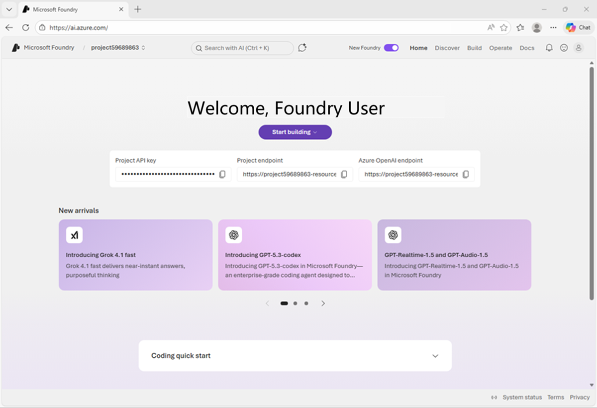

### Deploy a model

At the heart of every AI agent, there's a large language model (LLM). Let's find one in the Foundry models catalog.

1. Now you're ready to explore models. On the **Discover** page, select the **Models** tab to view the Microsoft Foundry model catalog.

    Microsoft Foundry provides a large collection of models from Microsoft, OpenAI, and other providers, that you can use in your AI apps and agents.

    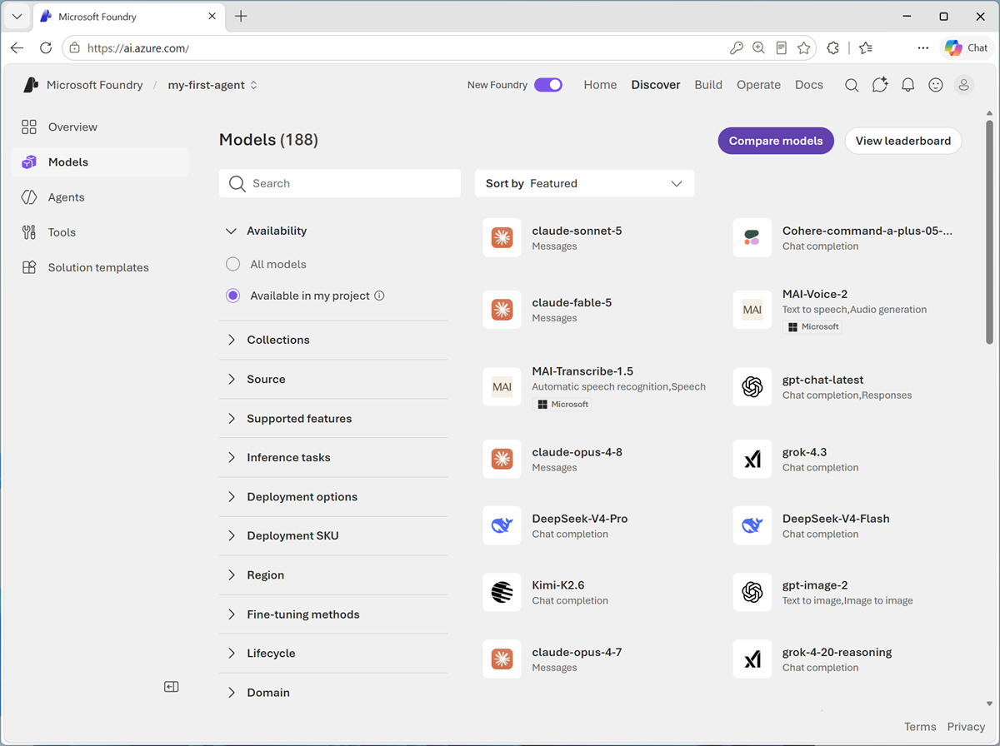

1. Search for and select the `gpt-5-mini` model, and view the page for this model, which describes its features and capabilities.

    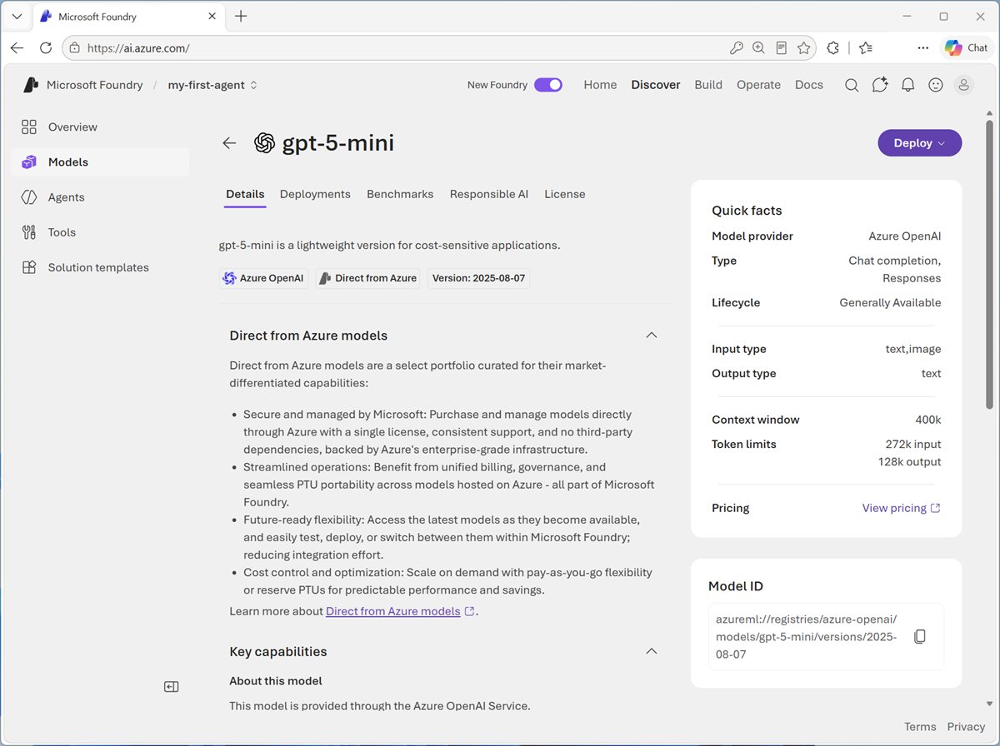

1. Use the **Deploy** button to deploy the model using the default settings. Deployment may take a minute or so.

    > **Tip**: Model deployments are subject to regional quotas. If you don't have enough quota to deploy the model in your project's region, you can use a different *gpt* chat-capable model - such as *gpt-5-nano*, or *gpt-5.4-mini*. Alternatively, you can create a new project in a different region.

1. When the model has been deployed, view the model playground page that is opened, in which you can chat with the model.

    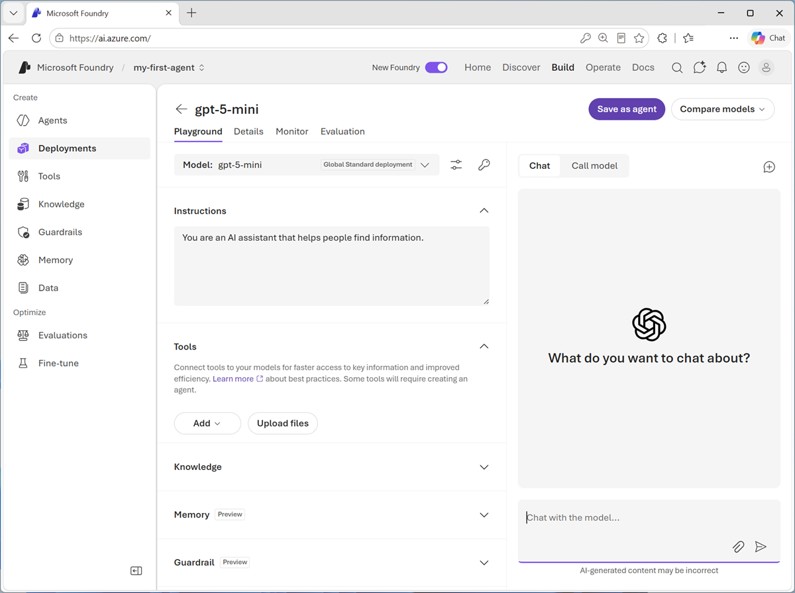

### Chat with the model

You can use the playground to explore the model by chatting with it.

1. Use the button at the bottom of the left navigation pane to hide it and give yourself more room to work with.
1. In the **Chat** pane, enter a prompt such as `Who was Ada Lovelace?`, and review the response.

    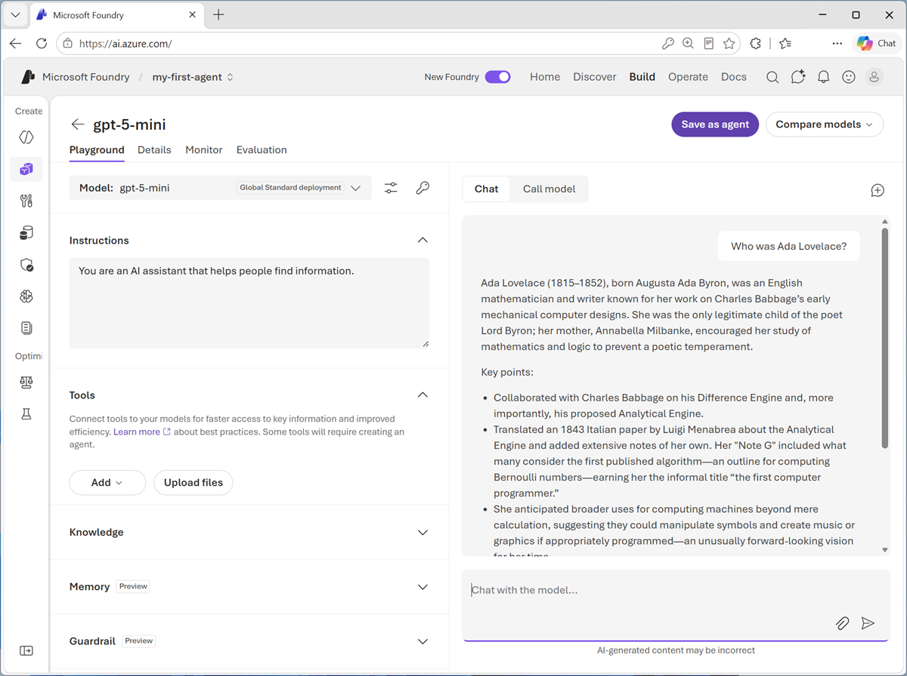

1. Enter a follow-up prompt, such as `Tell me more about her work with Charles Babbage.` and review the response.

    > **Note**: Generative AI chat applications often include the conversation history in the prompt; so the context of the conversation is retained between messages. In this case, "her" is interpreted as referring to Ada Lovelace.

1. At the top-right of the chat pane, use the **New chat** button to restart the conversation. This removes all conversation history.
1. Enter a new prompt, such as `Tell me about the ELIZA chatbot.` and view the response.
1. Continue the conversation with prompts such as `How does it compare with modern LLMs?`.

### Specify instructions in a *system prompt*

To support specific use cases, you should use a *system prompt* to provide the model with instructions that guide its responses. You can use the system prompt to give the model a specific focus or role, and provide guidelines about format, style, and constraints about what the model should and should not include in its responses.

1. In the model playground, at the top-right of the chat pane, use the **New chat** button to restart the conversation and remove the conversation history.
1. In the pane on the left, in the **Instructions** text area, change the system prompt to:

    ```
   You are an expert in the history of computing and AI. You only answer questions about significant people and events in the development of computing, and about notable vintage computers. Do not engage in conversations on any topic that is unrelated to computing history.
    ```

1. Now enter a new user prompt related to computing history, such as `What was Alan Turing's contribution to the development of AI?`

    Review the response, which should provide some history of computing information.

1. Try asking an "off-topic" question, such as `What's the capital of Spain?`; and view the response.

### Add a web_search tool

So far, the model has answered questions based on the data with which it was trained. While this is useful, that leaves out a lot of current information on the web; which might help the model give more relevant answers.

We can use *tools* to give models access to external data sources, and to perform custom tasks. Let's add a tool that enables the model to search the Web for up-to-date information.

1. In the pane on the left, under the instructions, expand the **Tools** section if it is not already expanded.
1. In the **Add** drop-down list, select **Web search**. Then read the information about the tool.
1. After adding the *web_search* tool, in the chat pane, enter the prompt `Find a vintage computer store near Seattle` (*or your local city!*) and review the response.

    The model should have searched the Web for vintage computer stores near the specific city.

### Save the model configuration as an agent

While you can implement generative AI apps using a standalone model, to create a fully agentic AI experience, you need to encapsulate the model, its instructions, and any tool configuration that provides additional functionality, in an *agent*.

1. In the model playground, at the top right select **Save as agent**. Then, when prompted, name your new agent `computing-historian`.

    When the agent is created, it opens in a new playground specifically for working with agents.

    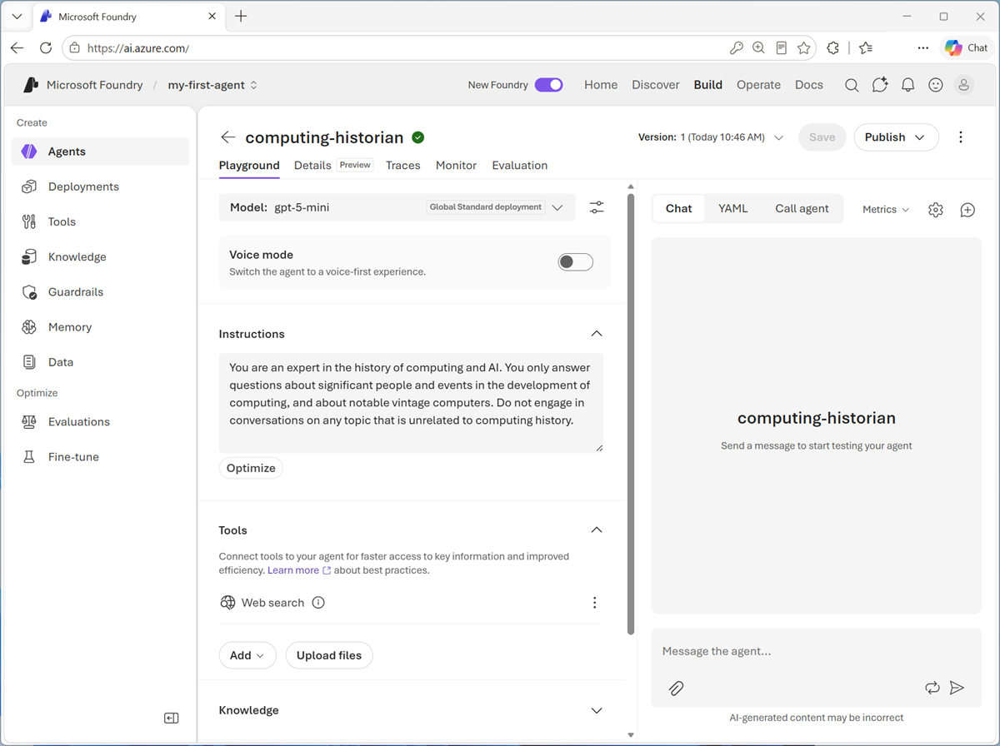

1. In the pane on the right, view the **YAML** tab, which contains the definition for your agent. Note that its definition includes the model, its parameter settings, and the instructions you specified - similar to this:

    ```yml
    metadata:
      logo: Avatar_Default.svg
      microsoft.voice-live.enabled: "false"
    object: agent.version
    id: computing-historian:1
    name: computing-historian
    version: "1"
    description: ""
    created_at: 1782917197
    definition:
      kind: prompt
      model: gpt-5-mini
      instructions: You are an expert in the history of computing and AI. You only answer questions about significant people and events in the development of computing, and about notable vintage computers. Do not engage in conversations on any topic that is unrelated to computing history.
      tools:
        - type: web_search
    status: active
    instance_identity:
      principal_id: c51143c7-2c5e-4d70-a7c1-759539926623
      client_id: c51143c7-2c5e-4d70-a7c1-759539926623
    blueprint:
      principal_id: 3a9a2794-b482-42f9-8b52-f7c0f80d2520
      client_id: e70779c8-c3ce-49c6-8ca6-8ea5037e9738
    blueprint_reference:
      type: ManagedAgentIdentityBlueprint
      blueprint_id: computing-historian-13bf1
    agent_guid: 13bf1394-7dfe-4c03-94b7-3e81a168d770
    ```

1. Switch back to the **Chat** tab, and enter the prompt `Who are you?`

    The response should indicate that the agent is "aware" of its role as a computing historian.

### Preview the agent

Now you have a working agent, you can preview it in a basic web chat application.

1. At the top of the chat pane, in the **Publish** drop-down list, select **Preview web app**.

    A preview chat interface is opened in a new browser tab.

1. Enter a prompt, such as `What can you tell me about the Altair 8800?` and view the response from your agent.

    

## Continue developing your agent in Visual Studio Code

Now you're ready to continue developing your agent using the Foundry integration features of Visual Studio Code.

The Foundry Toolkit extension for Visual Studio Code brings the assets in your Foundry projects right into the development environment.

1. Start Visual Studio Code
1. In the navigation bar on the left, view the **Extensions** page.
1. Search the extensions marketplace for `Foundry Toolkit`, and install the **Foundry Toolkit for VS Code** extension.

    The extension may take a minute or so to install.

1. After installing the extension, select the **Foundry Toolkit** page in the left navigation bar; and wait for it to load.

    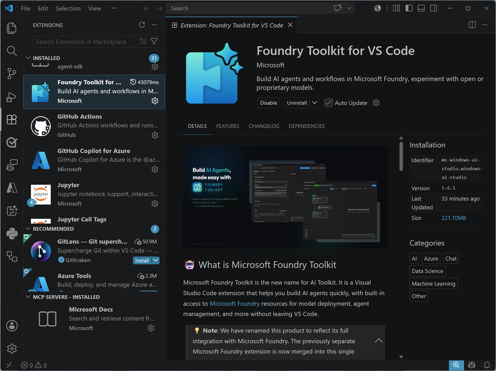

1. In the Foundry Toolkit pane, expand **My Resources** and set the default project by connecting to Azure (signing in with your credentials) and selecting the Foundry project you created previously.

    > **Tip**: If you did not complete the previous tasks, use the extension to sign into Azure and create a new project.

### Connect to your agent

Now that you have a connection to your Foundry project, you can access the assets you've created in it - including the *computing-historian* agent you created in the previous exercise.

> **Tip**: If you didn't complete the previous tasks, or have deleted your *computing-history* agent, use the **+** icon for the **Prompt agents** node to create a new agent named `computing-history` based on the *gpt-5-mini* model with the instructions `You are an expert in the history of computing and AI.` and add the *Web search* tool.

1. In the Foundry Toolkit pane, under your project, select **Agents** and on the **Prompt agents** tab, select the **computing-historian** agent you created previously.

    The latest version of the agent is opened in the **Agent Builder** interface within Visual Studio Code, so you can continue to develop and test it.

    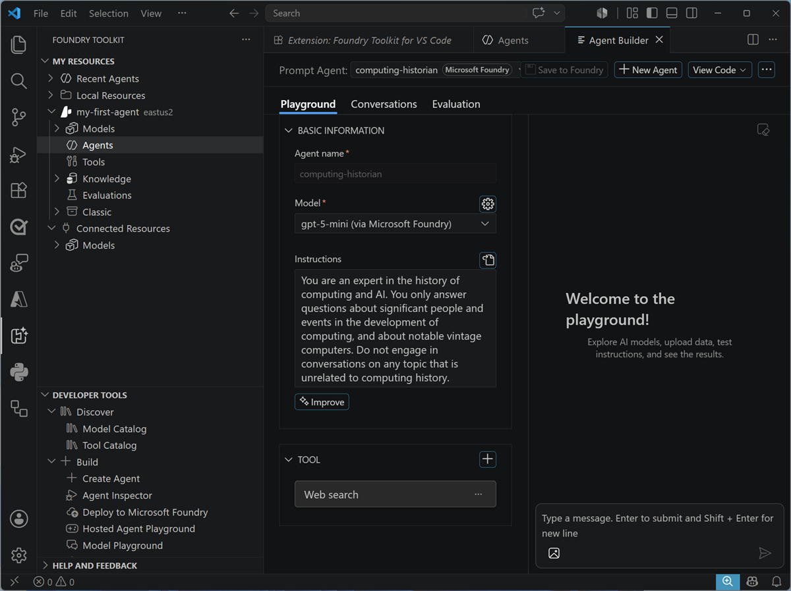

### Write code to test your agent

While you can use the graphical interface in the Foundry Portal and the Foundry Extension in Visual Studio code to develop and test an agent, eventually you'll want to write and test code. You can use the Azure AI Projects SDK and the OpenAI Responses API to do so.

1. In the **Agent Builder** pane, and select **View code**. Then when prompted, browse to the location on your local drive where you want to store your agent code (you can use any local folder).

    A new Visual Studio Code instance is opened, containing code files to work with your agent.

1. In the new Visual Studio Code workspace, select the **run_agent.py** code file. The code it contains should look similar to this:

    ```python
    """Build Agent using Microsoft Agent Framework in Python
    
    # Run this python script
    >
    > pip install agent-framework==<version>
    > python <this-script-path>.py
    """
    
    import asyncio
    import os
    from dotenv import load_dotenv
    
    from agent_framework_foundry import FoundryAgent
    from azure.identity.aio import DefaultAzureCredential
    
    load_dotenv()
    
    # User inputs for the conversation
    
    USER_INPUTS = [
        "Hello",
    ]
    
    async def main() -> None:
        # For authentication, DefaultAzureCredential supports multiple authentication methods. Run `az login` in terminal for Azure CLI auth.
        async with FoundryAgent(
            project_endpoint=os.environ["AZURE_AI_PROJECT_ENDPOINT"],
            agent_name="computing-historian",
            agent_version="1",
            credential=DefaultAzureCredential(),
        ) as agent:
    
            # Process user messages
            for user_input in USER_INPUTS:
                print(f"\n# User: '{user_input}'")
                printed_tool_calls = set()
                async for chunk in agent.run(user_input, stream=True):
                    # log tool calls if any
                    function_calls = [
                        c for c in chunk.contents
                        if c.type == "function_call"
                    ]
                    for call in function_calls:
                        if call.call_id not in printed_tool_calls:
                            print(f"Tool calls: {call.name}")
                            printed_tool_calls.add(call.call_id)
                    if chunk.text:
                        print(chunk.text, end="", flush=True)
                print("")
    
            print("\n--- All tasks completed successfully ---")
    
    if **name** == "**main**":
        try:
            asyncio.run(main())
        except KeyboardInterrupt:
            print("\nProgram interrupted by user")
        except Exception as e:
            print(f"An unexpected error occurred: {e}")
            import traceback
            traceback.print_exc()
        finally:
            print("Program finished.")
    ```

    Note the comments at the top of the file, which provide instructions for preparing the Python environment and running the script.

1. On the **Extensions** page, if it is not already installed, install the **Python** extension. Then, in the **Command Palette (Ctrl+Shift+P)**, use the command `python:create environment` (or `python:select interpreter`) to create a new *Venv* environment based on your Python 3.1x installation.

    > **Tip**: You can choose to install the workspace dependencies in the *requirements.txt* file as you create the environment. Don't worry of you accidentally skip this though; we'll do it in a later step anyway.

    When you have created the Python environment, a folder mamed **.venv** will be added to the workspace (not to be confused with the *.env* file, which contains environment variables for the program)

1. In the **Explorer** pane, right-click the **run_agent.py** file, and select **Open in integrated terminal**.

    > **Note**: Opening the terminal in Visual Studio Code should automatically activate the Python environment after a few seconds. If you're using a PowerShell terminal, you may need to enable running scripts on your system (see [Set-ExecutionPolicy](https://learn.microsoft.com/powershell/module/microsoft.powershell.security/set-executionpolicy){:target="_blank"}). If for any reason the Python environment is not activated automatically, you can use [this query](https://www.bing.com/search?q=%22How%20do%20I%20activate%20a%20Python%20venv%22){:target="_blank"} to search for information on how to activate it in your environment.

1. Ensure that the terminal is open in the **computinghistorian** folder with the prefix **(.venv)** to indicate that the Python environment you created is active.

    > **Tip**: You can enter the command `cls` to clear the console pane - which may make it easier to focus on the outputs from commands as you run them.

1. Install the required dependencies by running the following command:

    ```bash
   pip install agent-framework==1.10.0
    ```

    **Note**: This may be a different version from the one referenced in the same code and requirements.txt file.

1. After the libraries are installed (which may take a minute or so), use the following command to sign into Azure.

    ```bash
   az login
    ```

    > **Note**: In most scenarios, just using *az login* will be sufficient. However, if you have subscriptions in multiple tenants, you may need to specify the tenant by using the *--tenant* parameter. See [Sign into Azure interactively using the Azure CLI](https://learn.microsoft.com/cli/azure/authenticate-azure-cli-interactively) for details.

1. When prompted, follow the instructions to sign into Azure. Then complete the sign in process in the command line, viewing (and confirming if necessary) the details of the subscription containing your Foundry resource.
1. After you have signed in, enter the following command to run the application:

    ```bash
   python run_agent.py
    ```

    The code should run in the terminal, submit the user prompt "*Hello*" to your agent, and display the response (if not, resolve any errors and try again).

    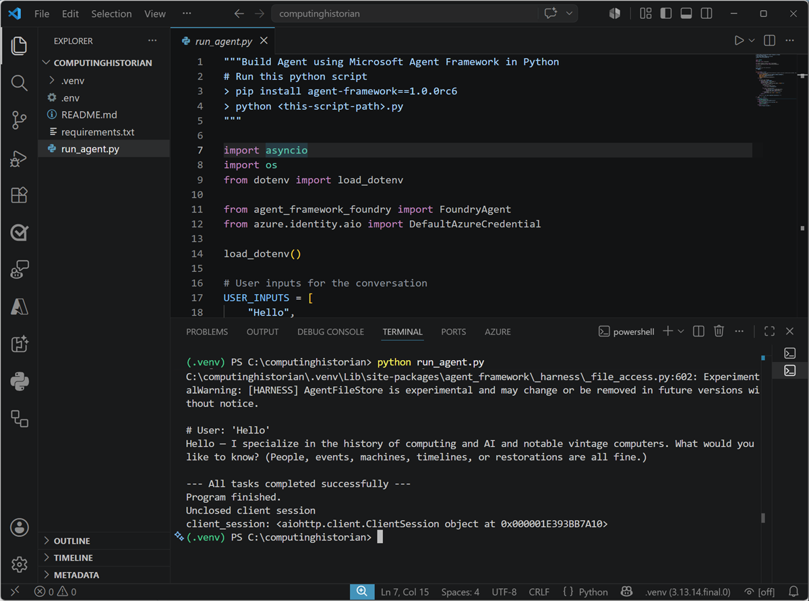

### Use GitHub Copilot to expand your code

GitHub Copilot provides agentic AI assistance in Visual Studio Code, helping you develop applications more efficiently.

> **Note**: GitHub Copilot in Visual Studio Code requires that you are signed in using a GitHub account. While agentic assistance is available in all GitHub plans, including free accounts, there are usage limitations.

1. In Visual Studio Code, in the **Extensions** pane, ensure that the **GitHub Copilot Chat** extension is installed and enabled.
1. At the bottom of the activity bar on the left, select **Accounts** and ensure that you are signed into your GitHub account. If not, sign in to use AI features.
1. On the toolbar, next to the search box, use the **Toggle Chat** button to show the chat pane on the right.

    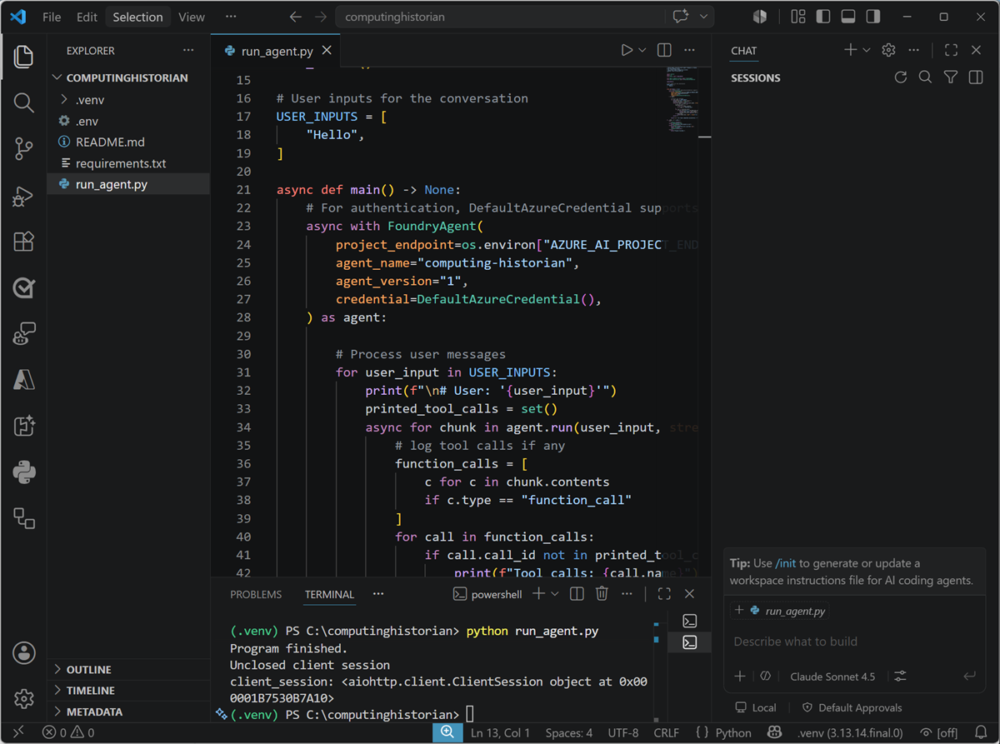

    The **Chat** pane is where you configure and use GitHub Copilot and connected agents to assist you with development tasks. You can select the model that GitHub Copilot uses, configure tools, and add custom agents. We'll use the default settings in this exercise.

1. Ensure the **run_agent.py** code file is open in the editor, then in the **Chat** pane, enter the following prompt:

    ```
    Modify the code to iteratively ask the user to enter a prompt for the agent and display the results, running until the user enters "quit". 
    ```

1. Enter the prompt, and wait while GitHub Copilot reviews and modifies your code. Eventually the changes will be staged and displayed.

    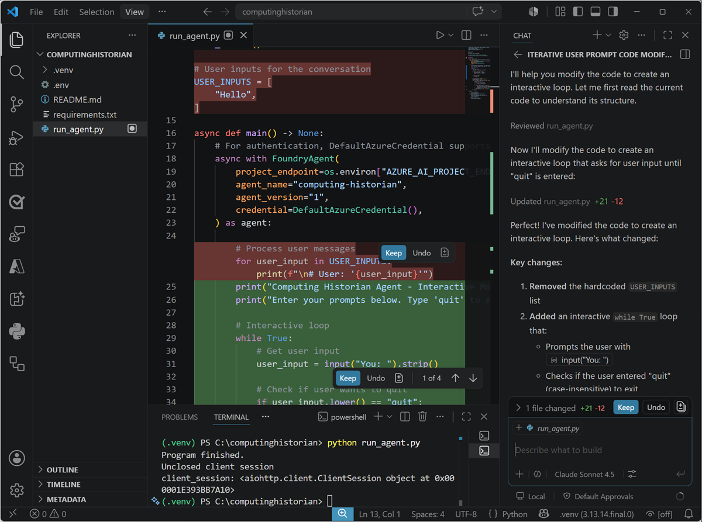

1. With the changes staged, in the terminal, re-run the code (`python agent.py`).

    This time the app should continually ask you to enter a prompt and display the results until you enter "quit". (if not, continue to iterate with GitHub Copilot in the chat pane, explaining the behavior you want and any errors that occur until the code works as expected.)

    Some suggested prompts to try:

    - `Tell me about the Commodore 64`
    - `What was the ZX Spectrum?`
    - `What was Grace Hopper's contribution to computing?`

    When you're finished, enter `quit`.

1. If you're happy with the code that GitHub Copilot has generated, use the **Keep** button in the **Chat** pane to confirm the changes.

## Use your agent in a client app

So far you've developed and tested your agent within a Foundry project. To take it into production, you need to write code that consumes it from its dedicated endpoint. That means you can move beyond playground testing and start integrating the agent into a real user experience.

1. If you don't already have it open; in a web browser, open [Microsoft Foundry](https://ai.azure.com){:target="_blank"} at `https://ai.azure.com` and sign in using your Azure credentials. Then switch to the **New Foundry** view if necessary, and open the project in which you created the *computing-historian* agent.
1. Select the **Build** menu, and in the **Agents** page, select the **computing-historian** agent.
1. In the **computing-historian** agent page, view the **Details** tab. In particular, note the **Responses** protocol endpoint that clients apps can use to call your agent via the OpenAI Responses API. You'll need this later!

### Configure a client application in Visual Studio Code

A partially completed client application for your agent has been provided. You'll complete this app and test it with your agent endpoint.

1. Open Visual Studio Code if it is not already open, and close any open workspaces.
1. Open the command palette (*Ctrl+Shift+P*) and use the `Git:clone` command to clone the `https://github.com/MicrosoftLearning/mslearn-agent-quickstart` repo to a local folder (it doesn't matter which one). Then open it.

    You may be prompted to confirm you trust the authors.

1. View the **Extensions** pane; and if it is not already installed, install the **Python** extension.
1. In the **Command Palette**, use the command `python:create envionment`(or `python:select interpreter`) to create a new **Venv** environment based on your Python 3.1x installation.

    > **Tip**: If you are prompted to install dependencies, you can install the ones in the *requirements.txt* file in the */computer-history-client* folder; but it's OK if you don't - we'll install them later!

    Wait for the environment to be created.

1. In the **Explorer** pane, navigate to the folder containing the application code files at **/computer-history-client**. The application files include:
    - **.env** (the application configuration file)
    - **agent_client.py** (the code file for the Python code to interact with your agent)
    - **app.py** (the main code file for a Python Flask-based web application)
    - **README.md** (information about the app)
    - **requirements.txt** (the Python package dependencies that need to be installed)
1. In the **Explorer** pane, right-click the **agent_client.py** file, and select **Open in integrated terminal**.

    > **Note**: Opening the terminal in Visual Studio Code should automatically activate the Python environment after a few seconds. If you're using a PowerShell terminal, you may need to enable running scripts on your system (see [Set-ExecutionPolicy](https://learn.microsoft.com/powershell/module/microsoft.powershell.security/set-executionpolicy){:target="_blank"}). If for any reason the Python environment is not activated automatically, you can use GitHub Copilot to help you activate it.

1. Ensure that the terminal is open in the **/computer-history-client** folder with the prefix **(.venv)** to indicate that the Python environment you created is active.
1. Install the required Python packages by running the following command:

    ```
   pip install -r requirements.txt
    ```

1. In the **Explorer** pane, in the **/computer-history-client** folder, select the **.env** file to open it. Then update the configuration values to replace *your_agent_endpoint_url* with the **Responses API endpoint** for your published agent.

1. Save the updated **.env** file.

### Add code to interact with your agent

Now you're ready to implement the code that will submit prompts to your agent.

1. In the **Explorer** pane, in the **/computer-history-client** folder, select the **agent_client.py** file (<u>not</u> *app.py*) to open it.
1. Review the existing code. You will add code to use the OpenAI Response API to interact with your agent.

    > **Tip**: As you add code to the code file, be sure to maintain the correct indentation.

1. Find the comment **Import Azure Identity and OpenAI client libraries**, and add the following code to import the Azure Identity classes required to use Entra ID authentication, and the OpenAI library.

    ```python
   # Import Azure Identity and OpenAI client libraries
   from azure.identity import DefaultAzureCredential, get_bearer_token_provider
   from openai import OpenAI
    ```

1. In the **AgentClient** class, in the ****init**** function, note that code has been provided to load the agent endpoint from the environment configuration file. Then find the comment **Create OpenAI client authenticated with Azure credentials** and add the following code to create an authenticated OpenAI client for your agent:

    ```python
   # Create OpenAI client authenticated with Azure credentials 
   self.client = OpenAI(
        api_key=get_bearer_token_provider(
            DefaultAzureCredential(), 
            "https://ai.azure.com/.default"
        ),
        base_url=self.agent_endpoint,
        default_query={"api-version": "v1"}
   )
    ```

1. In the **send_message** function, note that code to add the user's prompt to the conversation history has been provided. Then, in the **try** block, find the comment **Send prompt with full conversation history and get response** and add the following code to submit the prompt to the agent and get the response.

    ```python
   # Send prompt with full conversation history and get response
   response = self.client.responses.create(
        input=self.conversation_history
   )
   assistant_message = response.output_text
    ```

1. Read through the rest of the code, using the comments to understand the technique of tracking user inputs and responses in a conversation history.
1. Save the updated **agent_client.py** file.

### Run the client application

Now you're ready to test the app with your agent.

1. In the terminal, use the following command to sign into Azure.

    ```powershell
   az login
    ```

    > **Note**: In most scenarios, just using *az login* will be sufficient. However, if you have subscriptions in multiple tenants, you may need to specify the tenant by using the *--tenant* parameter. See [Sign into Azure interactively using the Azure CLI](https://learn.microsoft.com/cli/azure/authenticate-azure-cli-interactively) for details.

1. When prompted, follow the instructions to sign into Azure. Then complete the sign in process in the command line, viewing (and confirming if necessary) the details of the subscription containing your Foundry resource.
1. After you have signed in, enter the following command to run the application:

    ```powershell
   python app.py
    ```

1. When the Flask application starts, open your browser and navigate to the URL where it is running - for example, [http://127.0.0.1:5000](http://127.0.0.1:5000) (`http://127.0.0.1:5000`).

    The application web site should look like this:

    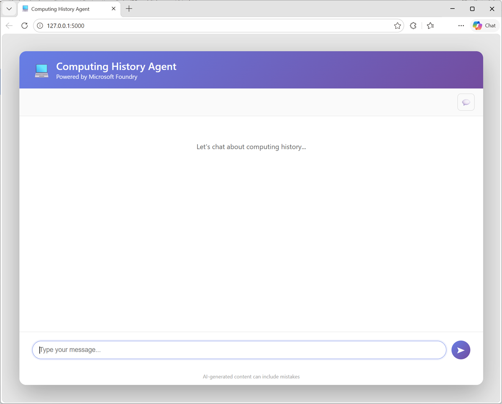

1. Enter a prompt, such as `What was ENIAC?` and view the response.
1. Follow up with a second prompt, such as `How does it compare with COLOSSUS?`
1. Try more prompts, like `Find the latest news for vintage computer enthusiasts.`

    Your agent should use its knowledge and tools to provide useful information and insights into computing history related topics.

1. When you're finished testing the app, in the terminal pane, enter **CTRL+C** to stop the local web server.

## Summary

In this exercise, you built a client application that uses an agent you developed in Microsoft Foundry.

> **[Ask Anton](https://aka.ms/azk-anton){:target="_blank"}**<br/><br/>If you have questions about some of the topics covered in this lab, *[Ask Anton](https://aka.ms/azk-anton){:target="_blank"}* is a generative AI-based agent that you can ask about AI concepts and Microsoft Foundry. Open the app at **[https://aka.ms/azk-anton](https://aka.ms/azk-anton){:target="_blank"}** and use the **Configure** button to enter your Foundry project and model details.<br/><br/>*Ask Anton is not a supported Microsoft product or a component of Microsoft Learn or AI Skills Navigator. Just an example of an AI agent for you to explore as you learn about what's possible with AI.*<br/><br/>If you *do* check out Ask Anton, we'd love you to *[tell us about your experience](https://forms.office.com/r/fC0ndfBQeK){:target="_blank"}*!

If you have finished exploring Microsoft Foundry, you should delete the Azure resources created in this lab to avoid unnecessary utilization charges.

## Next steps

Check out the following training resources to dive deeper into AI app and agent development on Azure:

- [Develop Generative AI apps in Azure](https://aiskillsnavigator.microsoft.com/explore/search/learningpath-83c73f92b07ec44b678fe87608ac5812111e0caacf7308b47afccec1f274ccc4){:target="_blank"}
- [Develop AI agents on Azure](https://aiskillsnavigator.microsoft.com/explore/search/learningpath-e479cf28c8a127f98d3d45961214485266d85b486991cebf33fe779fb53a0190){:target="_blank"}
- [Develop natural language solutions on Azure](https://aiskillsnavigator.microsoft.com/explore/search/learningpath-37cace5b5d91825002d4c09e3f3f98d9027e1b2a79b490b663684c4703361ca7){:target="_blank"}
- [Extract visual insights from data on Azure](https://aiskillsnavigator.microsoft.com/explore/search/learningpath-d0b0e550fda9d8fc957788736aaee66351967ea44dbad310f4f8dae94a21cfa2){:target="_blank"}
- [Develop AI Information Extraction solutions on Azure](https://aiskillsnavigator.microsoft.com/explore/search/learningpath-796e69a13e07dffb16c3a979eb65711e5884ecee17cf595f4eb9b604e919a428){:target="_blank"}
