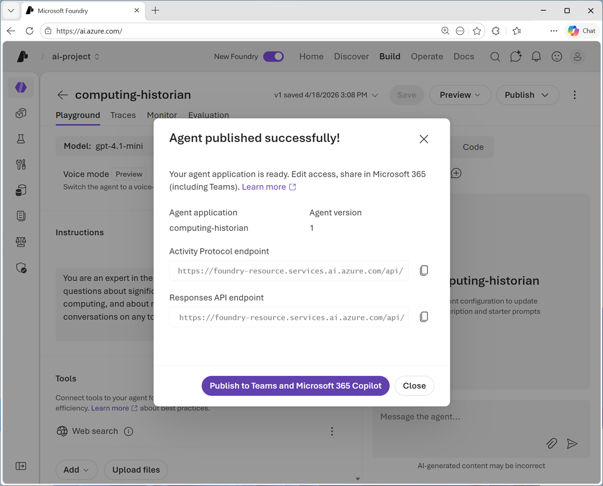

---
lab:
  title: Publish and use your agent
  description: Publish your agent and use it in a client application.
  level: 200
  duration: 20 minutes
  islab: true
---

# Publish and use your agent

In the previous exercises, used Microsoft Foundry and Visual Studio code to develop a computing history agent.

Now you're ready to publish the agent to its own endpoint, and consume it in an application.

This exercise should take approximately **20** minutes to complete.

## Publish your agent

So far you've developed and tested your agent within a Foundry project. To take it into production, you need to publish it to a dedicated endpoint from which client applications can consume it.

1. In a web browser, open [Microsoft Foundry](https://ai.azure.com){:target="_blank"} at `https://ai.azure.com` and sign in using your Azure credentials.
1. Switch to the **New Foundry** view if necessary, and open the project in which you created the *computing-historian* agent.
1. Select the **Build** menu, and in the **Agents** page, select the **computing-historian** agent.
1. In the **Publish** drop-down list, select **Publish agent** and publish the latest version of your agent.
1. View the published agent details. In particular, note the **Responses API endpoint** that clients apps can use to connect to your agent. You'll need this later!

    

1. Note that you can perform additional steps to publish your agent for integration with Teams and Microsoft 365 Copilot. However, in this exercise, select **Close**.

    > **Tip**: You can use the **View details** option in the **Publish** drop-down list to re-open the agent details.

## Configure a client application in Visual Studio Code

A partially completed client application for your agent has been provided. You'll complete this app and test it with your agent endpoint.

1. Open Visual Studio Code.
1. Open the command palette (*Ctrl+Shift+P*) and use the `Git:clone` command to clone the `https://github.com/MicrosoftLearning/mslearn-agent-quickstart` repo to a local folder (it doesn't matter which one). Then open it.

    You may be prompted to confirm you trust the authors.

1. View the **Extensions** pane; and if it is not already installed, install the **Python** extension.
1. In the **Command Palette**, use the command `python:create envionment`(or `python:select interpreter`) to create a new **Venv** environment based on your Python 3.1x installation.

    > **Tip**: If you are prompted to install dependencies, you can install the ones in the *requirements.txt* file in the */computer-history-client* folder; but it's OK if you don't - we'll install them later!

    Wait for the environment to be created.

1. In the **Explorer** pane, navigate to the folder containing the application code files at **/computer-history-client**. The application files include:
    - **.env** (the application configuration file)
    - **agent_client.py** (the code file for the Python code to interact with your agent)
    - **app.py** (the main code file for a Python Flask-based web application)
    - **README.md** (information about the app)
    - **requirements.txt** (the Python package dependencies that need to be installed)
1. In the **Explorer** pane, right-click the **agent_client.py** file, and select **Open in integrated terminal**.

    > **Note**: Opening the terminal in Visual Studio Code will automatically activate the Python environment. If you're using a PowerShell terminal by default, you may need to enable running scripts on your system. See [Set-ExecutionPolicy](https://learn.microsoft.com/powershell/module/microsoft.powershell.security/set-executionpolicy) for details.

1. Ensure that the terminal is open in the **/computer-history-client** folder with the prefix **(.venv)** to indicate that the Python environment you created is active.
1. Install the required Python packages by running the following command:

    ```
    pip install -r requirements.txt
    ```

1. In the **Explorer** pane, in the **/computer-history-client** folder, select the **.env** file to open it. Then update the configuration values to replace *your_agent_endpoint_url* with the **Responses API endpoint** for your published agent.
1. Save the updated **.env** file.

## Add code to interact with your agent

Now you're ready to implement the code that will submit prompts to your agent.

1. In the **Explorer** pane, in the **/computer-history-client** folder, select the **agent_client.py** file (<u>not</u> *app.py*) to open it.
1. Review the existing code. You will add code to use the OpenAI Response API to interact with your agent.

    > **Tip**: As you add code to the code file, be sure to maintain the correct indentation.

1. Find the comment **Import Azure Identity and OpenAI client libraries**, and add the following code to import the Azure Identity classes required to use Entra ID authentication, and the OpenAI library.

    ```python
   # Import Azure Identity and OpenAI client libraries
   from azure.identity import DefaultAzureCredential, get_bearer_token_provider
   from openai import OpenAI
    ```

1. In the **AgentClient** class, in the ****init**** function, note that code has been provided to load the agent endpoint from the environment configuration file. Then find the comment **Create OpenAI client authenticated with Azure credentials** and add the following code to create an authenticated OpenAI client for your agent:

    ```python
   # Create OpenAI client authenticated with Azure credentials 
   self.client = OpenAI(
        api_key=get_bearer_token_provider(
            DefaultAzureCredential(), 
            "https://ai.azure.com/.default"
        ),
        base_url=self.agent_endpoint,
        default_query={"api-version": "2025-11-15-preview"}
   )
    ```

1. In the **send_message** function, note that code to add the user's prompt to the conversation history has been provided. Then, in the **try** block, find the comment **Send prompt with full conversation history and get response** and add the following code to submit the prompt to the agent and get the response.

    ```python
   # Send prompt with full conversation history and get response
   response = self.client.responses.create(
        input=self.conversation_history
   )
   assistant_message = response.output_text
    ```

1. Read through the rest of the code, using the comments to understand the technique of tracking user inputs and responses in a conversation history.
1. Save the updated **agent_client.py** file.

## Run the client application

Now you're ready to test the app with your agent.

1. In the terminal, use the following command to sign into Azure.

    ```powershell
    az login
    ```

    > **Note**: In most scenarios, just using *az login* will be sufficient. However, if you have subscriptions in multiple tenants, you may need to specify the tenant by using the *--tenant* parameter. See [Sign into Azure interactively using the Azure CLI](https://learn.microsoft.com/cli/azure/authenticate-azure-cli-interactively) for details.

1. When prompted, follow the instructions to sign into Azure. Then complete the sign in process in the command line, viewing (and confirming if necessary) the details of the subscription containing your Foundry resource.
1. After you have signed in, enter the following command to run the application:

    ```powershell
   python app.py
    ```

1. When the Flask application starts, open your browser and navigate to [http://localhost:5000](http://localhost:5000) (`http://localhost:5000`).

    The application web site should looks like this:

    

1. Enter a prompt, such as `What was ENIAC?` and view the response.
1. Follow up with a second prompt, such as `How does it compare with COLOSSUS?`
1. When you're finished testing the app, in the terminal pane, enter **CTRL+C** to stop the local web server.

## Summary

In this exercise, you published an agent that you have developed, and implemented a client application that uses it.

## Next steps

This is the third and final exercise in a series of lab exercises. Check out the following training resources to dive deeper into AI app and agent development on Azure:

- [Develop Generative AI apps in Azure](https://aiskillsnavigator.microsoft.com/explore/search/learningpath-83c73f92b07ec44b678fe87608ac5812111e0caacf7308b47afccec1f274ccc4)
- [Develop AI agents on Azure](https://aiskillsnavigator.microsoft.com/explore/search/learningpath-e479cf28c8a127f98d3d45961214485266d85b486991cebf33fe779fb53a0190)
- [Develop natural language solutions on Azure](https://aiskillsnavigator.microsoft.com/explore/search/learningpath-37cace5b5d91825002d4c09e3f3f98d9027e1b2a79b490b663684c4703361ca7)
- [Extract visual insights from data on Azure](https://aiskillsnavigator.microsoft.com/explore/search/learningpath-d0b0e550fda9d8fc957788736aaee66351967ea44dbad310f4f8dae94a21cfa2)
- [Develop AI Information Extraction solutions on Azure](https://aiskillsnavigator.microsoft.com/explore/search/learningpath-796e69a13e07dffb16c3a979eb65711e5884ecee17cf595f4eb9b604e919a428)

### Clean up

If you have finished exploring Microsoft Foundry, you should delete the resources you have created to avoid unnecessary utilization charges.

1. Open the [Azure portal](https://portal.azure.com){:target="_blank"} at `https://portal.azure.com` and view the contents of the resource group where you deployed the project used in this exercise.
1. On the toolbar, select **Delete resource group**.
1. Enter the resource group name and confirm that you want to delete it.
